Coda + FuelPHPでお手軽開発環境を作る
====================================

今年、私がもっともはまった言語系のプロダクトと言えば「FuelPHP」になります。

そんな、FuelPHPの Advent Calendarが開催されていたので、私も参加いたしました。 昨日の [@LandscapeSketch](http://twitter.com/LandscapeSketch) さんの「[FuelPHP + NetBeans + Gitで高速開発環境を整える](http://worktoolsmith.com/2012/12/fuelphp_atnd_netbeans/)」を受けて、私からは「Coda + FuelPHPでお手軽開発環境を作る」をお送りします。

Codaとは、Panic社から販売されている OS X向けの Web開発ソフトです。軽量・高機能で筆者ももっとも愛用しているソフトの一つです。

この「Coda」、名前からしてHTMLのコーディングにしか使えないだろうと思われている方も少なくないのですが、実はプログラミングにも最適な開発ソフトです。ここでは、FuelPHPを少しでも開発しやすくするための、各種機能を紹介していきましょう。

セットアップ
------------

Codaの最新バージョンは、「Coda 2(2.0.6)」です。Lion以降なら App Storeからワンクリックで購入・インストールをすることができます。それ以外の環境だったり、少しお試しをしてみたい場合は直販サイトから、ダウンロードすると良いでしょう。

-   [Coda 2](http://panic.com/jp/coda/)

起動すると、ファイルを開く画面が表示されますがキャンセルすれば「サイト管理」画面が表示されます。まずはこのまま無視して、右上の「＋」ボタンをクリックしましょう。

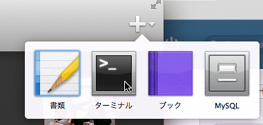

「ターミナル」をクリックすると、Coda内でターミナルを開くことができます。ここで、次のように打ち込んで、[公式ドキュメント](http://fuelphp.com/docs/installation/instructions.html) に従って次のようにプロジェクトを作っていきます。

> oil create

oilがインストールされていない場合は、先にこちらを打ち込みます。

> curl get.fuelphp.com/oil | sh

こうして、FuelPHPをダウンロードしてプロジェクトを作ることができました。

ローカルサーバーの構築
----------------------

続いて、このプロジェクトを動作させるための、Webサーバーを準備します。コマンドラインに長けている場合には、HomeBrewなどを利用して Apache+MySQLをセットアップしても良いですが、筆者は手軽に MAMPを利用して構築しています。

-   [MAMP](http://www.mamp.info/en/index.html)

セットアップしたら、MAMPの環境設定から「Apache→Document Root」の設定を先ほど作ったプロジェクトの「public」フォルダに設定しておきます。

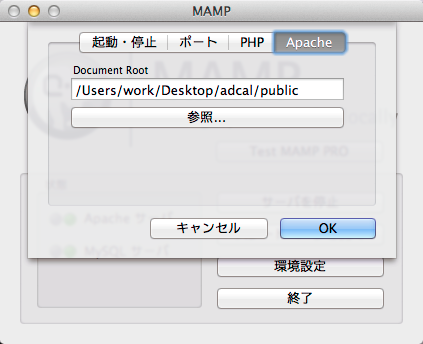

Webブラウザで、次のアドレスにアクセスすれば初期画面が見えるはずです。

> http://localhost:8888

サイトの設定
------------

次に、サイトを作ります。Codaのツールバーで一番左の「サイト」ボタンをクリックし、さらに左下の「+」ボタンをクリックします。

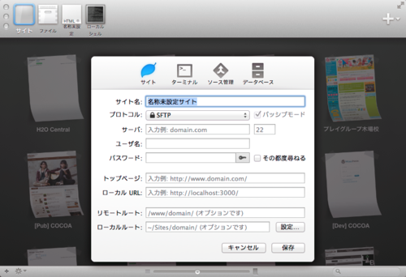

それぞれ、以下のように設定していきます。

-   サイト名： 見分けのつく適当な名前をつけます
-   ローカルURL： 「http://localhost:8888」を設定します
-   ローカルルート： 先ほど作ったプロジェクトのディレクトリを設定します

その他の設定項目は FTPに関わるものなので、サイトを公開するときに設定すれば良いでしょう。こうすると、サイトのアイコンができあがります。

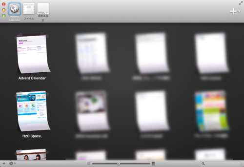

ファイルを編集する
------------------

サイトアイコンをダブルクリックすると、画面の右側にファイルのリストが表示されるので、ここから必要なファイルをダブルクリックして編集することができます。まずは、「fuel/app/config/config.php」を編集し、必要な設定項目を書き加えましょう。

    ini_set('default_charset', 'UTF-8');

    return array(
        'language' => 'ja',
        'locale' => 'ja_JP.utf8',
        'default_timezone' => 'Asia/Tokyo',
        'always_load' => array(
            'packages' => array(
                'orm',
            ),
            'config' => array(
            ),
        ),
    );

さらに、「fuel/config/development/db.php」も編集します。MAMPのデータベースに接続するには、次のような設定にすると良いでしょう。

\<

pre\> return array( ‘default’ =\> array( ‘type’ =\> ‘mysql’, ‘connection’ =\> array( ‘hostname’ =\> ‘:/Applications/MAMP/tmp/mysql/mysql.sock’, ‘database’ =\> ‘test’, ‘username’ =\> ‘root’, ‘password’ =\> ‘root’, ), ), );

次に、oilでファイルを作ってみます。

右上の「＋」ボタンからターミナルを起動してみましょう。サイトを定義した状態でターミナルを起動すると、自動的にパスがプロジェクトのパスになるため、非常に便利です。

次のコマンドを打ち込んで、Scaffoldを作ります。

> oil g scaffold message name:varchar[500] message:text oil refine migrate

確認する
--------

それでは、今作ったページを確認してみましょう。Codaは、Webブラウザの機能も内蔵しています。画面右上の「＋」ボタンで、「書類」を選んだ後上部の「プレビュー」ボタンをクリックしてください。

ボタンの隣のアドレスバーに、「http://localhost:8888/message」と打ち込んでアクセスします。

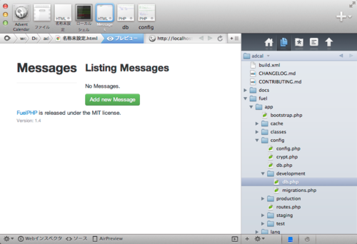

「場所」パネルを使う
--------------------

FuelPHPで開発をする場合、大抵のファイルは「fuel/app/classes」フォルダか「fuel/app/views」フォルダ内を編集することになるでしょう。そのため、これらのフォルダを「場所」パネルに登録しておくと、アクセスに便利です。

まず、画面右側のパネル画面で「ホーム」をクリックします。

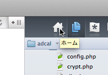

パネルの一覧が出るので「場所」ボタンを上部に登録してください。

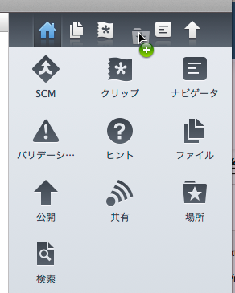

これで、場所パネルが気軽に使えるようになります。場所パネルを開いて、画面上部のタブから「ファイル」を選びます。すると、メインウィンドウにフォルダの一覧が表示されるので、よくアクセスするフォルダを場所パネルにドラッグドロップで追加していきましょう。

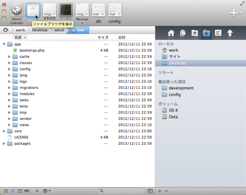

クリップを使う
--------------

FuelPHPを利用すると、例えばコントローラーを新しく作るときに「class Controller\_xxx extends Controller」と記述するなど、決まり文句が度々登場します。そのようなものは、「クリップ」に登録しておくと便利です。

「クリップ」パネルを開いて、左下の「＋」ボタンをクリックします。

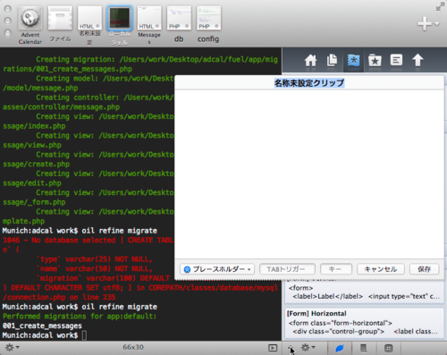

ここに、よく使うフレーズを登録していきます。この時、左下の「プレースホルダー」を挿入しておくと便利でしょう。例えば、次の図のようにコントローラー名の所に「挿入ポイント」を入れておきます。

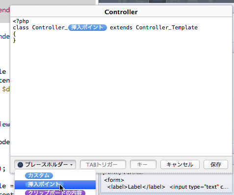

すると、このクリップを挿入したときにカーソルがこの場所に移動し、コントローラー名を入れるだけで済みます。クリップを使うには、ダブルクリックすれば良いでしょう。さらによく使う場合には「タブトリガー」や「ショートカット」を作ることもできます。詳しくは、Codaのヘルプをご覧下さい。

ブックを追加する
----------------

画面右上の「＋」をクリックして「ブック」を選ぶと、Codaに内蔵されているさまざまなリファレンスを閲覧することができます。

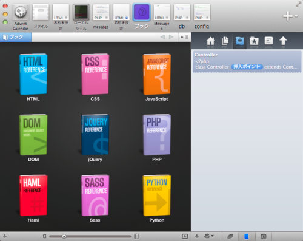

残念ながら、FuelPHPのリファレンスはありません。しかし、後から追加することができます。左下の「＋」ボタンをクリックしましょう。図のように設定します。

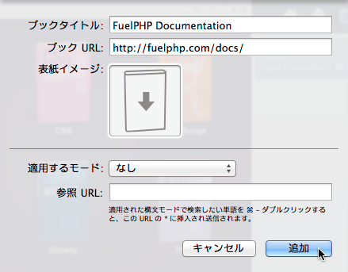

これで Coda上で FuelPHPのドキュメントを参照することができます。

画面分割で Codaを統合環境に
---------------------------

ここまで来たら、Codaは最強の統合開発環境になります。メイン画面右上の「画面分割」ボタンをクリックしましょう。画面が分割されます。Optionキーを押しながらだと縦に分割されます。

そして、分割したウィンドウでブックやエディタ、ブラウザを自由に開くことができます。

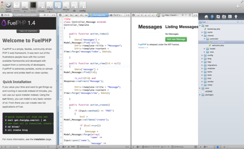

こうして、編集やプレビュー、ドキュメントの参照などを1画面内で行うことができるため、非常に効率よく開発をすることができるでしょう。

その他にも・・
--------------

Codaには、この他にも GitやFTP、MySQLなどを操作できる機能も内蔵されています。いずれも、使いやすく作られていて、一度使うと手放せません(ただし、Gitのクライアント機能はまだ若干開発途上です)。

「Coda」という名前は「HTMLコーダー」ではなく、「プログラマがコードを書く」という意味で「Coda」という名前なのではないか、と思えるほど開発者にうれしいソフトになっていますので、ぜひ一度使ってみてはいかがでしょうか？

明日は、[@yamamoto\_manabu](http://twitter.com/yamamoto_manabu) さんです。

