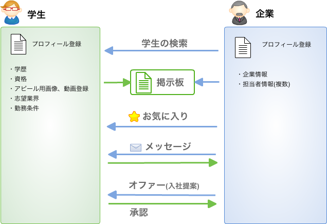
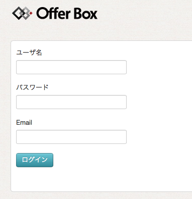
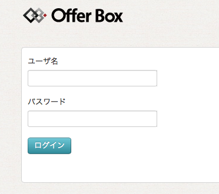
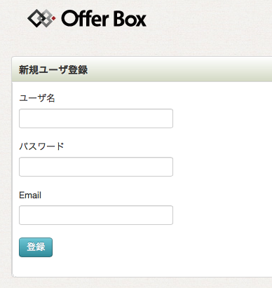
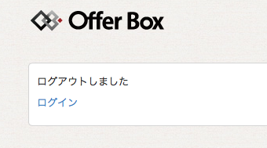

就職活動サイトの構築にFuelPHPを使ったので事例紹介 [@uemera](https://twitter.com/uemera)
=================================================

こんにちは。[FuelPHP Advent Calendar 2012](http://atnd.org/events/33753 "FuelPHP Advent Calendar 2012")に参加します上村と言います。  
 　  
 Advent Calendarの前日記事は[@yamamoto\_manabu](https://twitter.com/yamamoto_manabu)さんでした。  
 「[FuelPHP + eXcale | No Regret No Life](http://yamamoto.phpapps.jp/2012/12/13/6/)」  
 eXcaleという国産PaaSサービス上でFuelPHPを動かす方法を紹介しています。eXcaleは今なら無料だそうですよ！これはいいですね。  
 　  
 さて、私は就職活動に関するマッチングサイトOfferBoxを開発しており、そのシステムでFuelPHPを利用しています。  
 ここではその事例紹介と、ログイン周辺の実装についてご紹介します。  
 　  
 　

OfferBoxの紹介
--------------

[OfferBox](http://offerbox.jp/)という、就職活動マッチングサイトをFuelPHPで構築し、2012年9月から運用しています。  
 非会員用の紹介サイトはWordPressで作り、会員専用画面をFuelPHPで作っています。  
 ログイン画面はこちらです。  
 [https://offerbox.jp/offerbox/slogin](https://offerbox.jp/offerbox/slogin)  
 　  
 **開発の流れ**  
 2012/7 開発着手  
 2012/9 α版リリース  
 2012/12 β版リリース  
 　  
 **開発規模**  
 さくらVPS 4G  
 Apache + MySQL + PHP  
 FuelPHP V1.2.1  
 　  
 MySQL Table数:13  
 Controller数: 26  
 View数: 87  
 　  
 このOfferBoxというサイトでは、企業が自分のニーズに合った新卒の採用人材を検索し、適合する人材にコンタクトをとることができます。  
 学生とのコミュニケーションを図れるSNSのような機能を持っており、企業が学生に対してお気に入りをつけたりメッセージを送受信することができます。  
 気に入った学生が見つかれば、オファーをして面接の段取りを進めることができます。  
 　  

 　  
 　

2種類のログイン画面。その実装方法
---------------------------------

このシステムは学生と企業の双方が使うシステムであり、それぞれログインが必要ですので、学生用のログインと企業用のログインを別々に用意しています。  
 FuelPHPではログイン処理を作る際のひな形として[SimpleAuth](http://fuelphp.com/docs/packages/auth/simpleauth/intro.html)があり、その枠組みを利用するとログイン機能を1から作らなくても済みます。  
 SimpleAuthを使ったログイン機能の実装の事例は、いくつか紹介されています。  
 　  
 [FuelPHPで簡単認証システム | WinRoad徒然草](http://w.builwing.info/2012/02/28/fuelphp%E3%81%A7%E7%B0%A1%E5%8D%98%E8%AA%8D%E8%A8%BC%E3%82%B7%E3%82%B9%E3%83%86%E3%83%A0/)  
 [FuelPHPでログイン機能をサクっと実装 – BTT’s blog](http://btt.hatenablog.com/entry/2012/06/16/015506)  
 [[FuelPHP] FuelPHPで作るログイン管理 | 9ensanのLifeHack](http://9ensan.com/blog/programming/php/fuelphp/fuelphp-login-auth/)  
 　  
 しかし、複数のログイン機能を持ったサイト事例は無いみたいで、いろいろ探したのですが見つかりませんでした。  
  
 そのような状況で手探りで実装し、分からないことがいっぱいでしたが、なんとか作れましたのでご紹介します。  
 　  
 　

### auth使用の宣言

fuel/app/config/config.php  
 に定義します。

~~~~ {.brush:php}
'packages'  => array(
    'auth'
),
~~~~

  
 fuel/packages/auth/config/auth.php  
 を  
 fuel/app/config/  
 の下にコピーし、以下のように書きます。**StudentAuth**(学生ログイン用)と**CompanyAuth**(企業ログイン用)の2つのドライバを登録します。

~~~~ {.brush:php}
return array(
    'driver' => array('StudentAuth', 'CompanyAuth'),
    'verify_multiple_logins' => false,
    'salt' => '(適当な文字列)'
);
~~~~

  
 　

### ログイン用テーブルの作成

fuel/packages/auth/config/simpleauth.php  
 をコピーして、  
 fuel/packages/config/studentauth.php  
 にrenameし、以下のように書きます。

~~~~ {.brush:php}
    'table_name' => 'student',
~~~~

これはテーブル名の定義ですが、’users’となっていたテーブル名を’student’という名前に変えてます。  
 　  
 同様に、  
 fuel/packages/config/companyauth.php  
 を作成し、以下のように書きます。

~~~~ {.brush:php}
    'table_name' => 'company',
~~~~

こちらは企業ログイン用のテーブルです。  
 　  
 MySQLテーブルは、本家[SimpleAuthのマニュアル](http://fuelphp.com/docs/packages/auth/simpleauth/intro.html)に載っている  
 SQL文を使います。テーブル名はstudentとcompanyで作ります。

~~~~ {.brush:sql}
CREATE TABLE IF NOT EXISTS `student` (
  `id` int(11) NOT NULL AUTO_INCREMENT,
  `username` varchar(50) NOT NULL,
  `password` varchar(255) NOT NULL,
  `group` int(11) NOT NULL DEFAULT '1',
  `email` varchar(255) NOT NULL,
  `last_login` varchar(25) NOT NULL,
  `login_hash` varchar(255) NOT NULL,
  `profile_fields` text NOT NULL,
  `created` int(11) NOT NULL DEFAULT '0',
  PRIMARY KEY (`id`),
  UNIQUE KEY `username` (`username`,`email`)
);
CREATE TABLE IF NOT EXISTS `company` (
  `id` int(11) NOT NULL AUTO_INCREMENT,
  `username` varchar(50) NOT NULL,
  `password` varchar(255) NOT NULL,
  `group` int(11) NOT NULL DEFAULT '1',
  `email` varchar(255) NOT NULL,
  `last_login` varchar(25) NOT NULL,
  `login_hash` varchar(255) NOT NULL,
  `profile_fields` text NOT NULL,
  `created` int(11) NOT NULL DEFAULT '0',
  PRIMARY KEY (`id`),
  UNIQUE KEY `username` (`username`,`email`)
)
~~~~

  
 　

### 認証ロジックの作成

認証のためのロジックはfuel/packeges/の下に置くことになります。  
 このディレクトリはFuelPHPパッケージコアに含まれる部分なので、ここに手を入れるとFuelPHPコアとユーザ開発ロジックが分離できなくなるし、バージョンアップ時にも気を遣うので、僕はこのディレクトリはあまり触りたくないのですが、まぁでもここを触るしか方法が無いのでしょうがないですね。  
 　  
 fuel/packages/auth/bootstrap.phpは以下のようにします。  
 StudentAuthとCompanyAuth関連の定義を追加しています。

~~~~ {.brush:php; .highlight:[9,10,14,15,22,23,24,25,26,27]}
Autoloader::add_classes(array(
    'Auth\\Auth'           => __DIR__.'/classes/auth.php',
    'Auth\\AuthException'  => __DIR__.'/classes/auth.php',

    'Auth\\Auth_Driver'  => __DIR__.'/classes/auth/driver.php',

    'Auth\\Auth_Acl_Driver'     => __DIR__.'/classes/auth/acl/driver.php',
    'Auth\\Auth_Acl_SimpleAcl'  => __DIR__.'/classes/auth/acl/simpleacl.php',
    'Auth\\Auth_Acl_StudentAcl'  => __DIR__.'/classes/auth/acl/studentacl.php',
    'Auth\\Auth_Acl_CompanyAcl'  => __DIR__.'/classes/auth/acl/companyacl.php',
        
    'Auth\\Auth_Group_Driver'       => __DIR__.'/classes/auth/group/driver.php',
    'Auth\\Auth_Group_SimpleGroup'  => __DIR__.'/classes/auth/group/simplegroup.php',
    'Auth\\Auth_Group_StudentGroup'  => __DIR__.'/classes/auth/group/studentgroup.php',
    'Auth\\Auth_Group_CompanyGroup'  => __DIR__.'/classes/auth/group/companygroup.php',
        
    'Auth\\Auth_Login_Driver'          => __DIR__.'/classes/auth/login/driver.php',
    'Auth\\Auth_Login_SimpleAuth'      => __DIR__.'/classes/auth/login/simpleauth.php',
    'Auth\\SimpleUserUpdateException'  => __DIR__.'/classes/auth/login/simpleauth.php',
    'Auth\\SimpleUserWrongPassword'    => __DIR__.'/classes/auth/login/simpleauth.php',

    'Auth\\Auth_Login_StudentAuth'      => __DIR__.'/classes/auth/login/studentauth.php',
    'Auth\\StudentUserUpdateException'  => __DIR__.'/classes/auth/login/studentauth.php',
    'Auth\\StudentUserWrongPassword'    => __DIR__.'/classes/auth/login/studentauth.php',
    'Auth\\Auth_Login_CompanyAuth'      => __DIR__.'/classes/auth/login/companyauth.php',
    'Auth\\CompanyUserUpdateException'  => __DIR__.'/classes/auth/login/companyauth.php',
    'Auth\\CompanyUserWrongPassword'    => __DIR__.'/classes/auth/login/companyauth.php',
));
~~~~

  
 authパッケージには、ディレクトリはacl、group、loginの3種類あります。  
 aclとgroupのディレクトリは今回の要件には使わないので、必要なloginディレクトリの部分だけ拡張すれば良いと思っていましたが、acl、groupも同じように作らないとうまく機能しませんでした。  
 ということで以下のファイルを新規作成することになります。  
 　  

   
 　  
 　

#### 学生ログインロジックの作成

**studentauth.php**を作ります。simpleauth.phpをコピーしたものをベースに、そこから修正していきます。  
 ・ simpleauth.phpの中で、”Simple”や”simple”となっているところをかたっぱしから”Student”、”student”に置換します。  
 　クラス名、設定名などあらゆるもの。  
 　大文字、小文字にも気をつけて変換するようにします。  
 ・Session変数は学生用と企業用で名前が重複しないように考慮する必要があります。  
 　例:  
 　\\Session::set(‘username’, $this-\>user['username']);  
 　の場合は  
 　\\Session::set(‘studentusername’, $this-\>user['username']);  
 　のようにします。  
 ・**studentgroup.php**を作ります。simplegroup.phpをコピーしたものをベースに、そこから同じように文字列置換します。  
 ・**studentacl.php**を作ります。simpleacl.phpをコピーしたものをベースに、同じように文字列置換します。  
 　  
 　

#### 企業ログインロジックの作成

**companyauth.php**を作ります。simpleauth.phpをコピーしたものをベースに、そこから修正していきます。  
 ・simpleauth.phpの中で、”Simple”や”simple”となっているところをかたっぱしから”Company”、”company”に置換する。  
 ・**companygroup.php**を作ります。simplegroup.phpをコピーしたものをベースにします。  
 ・**companyacl.php**を作ります。simpleacl.phpをコピーしたものをベースにします。  
 　  
 　

### ログイン制御(Contoller)と画面(View)を作る

学生ログイン画面を作っていきます。  
 　  
 　

#### Controllerの作成

fuel/app/class/controller/studentlogin.php

~~~~ {.brush:php}
public function action_login()
{
    $data = array();

    // submitボタンによるPOST時
    if (Input::post())
    {
        // Authオブジェクトを取得します。引数でStudentAuthを指定します。
        $auth = Auth::instance('StudentAuth');

        if ($auth->login())
        {
            // 認証OKならログイン後のページへリダイレクトします。
            Response::redirect('studentindex');
        }
        else
        {
            // ログイン失敗時の処理
            $data['username']    = Input::post('username');
            $data['login_error'] = 'Wrong username/password combo. Try again';
        }
    }

    // 学生ログインページの表示
    echo View::forge('studentlogin',$data);
}
~~~~

#### Viewの作成

fuel/app/views/studentlogin.php

~~~~ {.brush:xml}
<?php echo Form::open( '/studentlogin/login'); ?>
ユーザ名<?php echo Form::input('username',  Input::post('username') ) ?>
パスワード<?php echo Form::password('password',  Input::post('password') ) ?>
<?php echo Form::submit('submit', 'ログイン',); ?>
<?php echo Form::close(); ?>
~~~~

  

   
 　  
 企業ログインは、**companylogin.php**とします。上記ソースコードの’student’の部分がcompnayになるだけです。  
 　  
 　

### ユーザ登録

ユーザ登録のメソッドをstudentlogin.phpに書きます。

#### Controller

fuel/app/class/controller/studentlogin.php

~~~~ {.brush:php}
public function action_add_user()
{
    if (Input::post())
    {
        $username=Input::post('username');
              $password=Input::post('password');
              $email=Input::post('email');

              // Authオブジェクトを取得します。引数でStudentAuthを指定します。
        $auth = Auth::instance('StudentAuth');
        // ユーザ作成
        $auth->create_user($username,$password,$email);
    }
    // 登録フォームの表示
    echo View::forge('studentadduser_user');
}
~~~~

  
 企業ユーザ登録も同様に、companylogin.phpに同じメソッドを作ります。上記ソースコードの’student’の部分をがcompnayになるだけです。  
 　

#### View

fuel/app/views/studentadduser.php

~~~~ {.brush:xml}
<?php echo Form::open( '/studentlogin/add_user'); ?>
ユーザ名<?php echo Form::input('username',  Input::post('username') ) ?>
パスワード<?php echo Form::password('password',  Input::post('password') ) ?>
Email<?php echo Form::input('email',  Input::post('email') ) ?>
<?php echo Form::submit('submit', '登録') ?>
<?php echo Form::close(); ?>
~~~~

企業ユーザ用View(companyadduser.php)も同様です。studentの部分をcompanyに置換します。  
 　  

   
 　  
 　

### ログアウト

学生ログアウトのメソッドをstudentlogin.phpに書きます。

#### Controller

fuel/app/class/controller/studentlogin.php

~~~~ {.brush:php}
public function action_logout()
{
    //ログアウト
    Auth::logout();
    //ログアウト画面の表示
    echo View::forge('studentlogout');
}   
~~~~

企業ログアウトはcompnaylogin.phpに書きます。  
 　  
 Viewはこちら  
 fuel/app/views/studentlogout.php

~~~~ {.brush:xml}
ログアウトしました
ログイン
~~~~

企業ユーザも同様です。studentの部分をcompanyにします。  
 　  

   
 　  
 　

### ログイン後の画面

ログイン後の画面とは、ログインに成功したら表示する最初の画面のことです。  
 ログイン中の状態の場合のみ表示が許される画面ですので、認証が成功しているかどうかをControllerでチェックする必要があります。  
 企業ユーザでログイン中にもかかわらず、学生用の画面を開いた場合は、誤動作を防ぐために企業側のログアウト処理をするようにしています。  
 実際のユースケースでは企業と学生の両方のアカウントを持つ人はいないのですが、開発の現場ではテスト時にそういう使い方もするので、一応その考慮を入れています。  
   
  
 fuel/app/class/controller/studentlogin.php

~~~~ {.brush:php}
// 事前処理
public function before()
{
    $this->auth = Auth::instance('StudentAuth');
    // ここで、企業ログイン中であればログアウトする。
    if( Session::get('companyusername') ){
        Auth::logout();
    }

    // ログインチェック
    if( !$this->auth->check('StudentAuth') ){
        // 認証に失敗したらログイン画面にジャンプ
        Response::redirect('/studentlogin');
    }
}
    
// ログイン後トップ画面
public function action_index()
{
    // ログイン後トップ画面の表示
    echo View::forge('studentindex');
}
~~~~

企業用も同様です。studentの部分をcompanyにします。companyの部分はstudentにします。  
 　  
 　

### さいごに

このように、1つのサイトで複数のログイン機能を実装する場合は、SimpleAuthを単にコピーして”Simple”の部分の文字列を置換するだけではダメです。  
 追加作業として  
 ・セッションの名前が重複しないようにする。  
 ・学生と企業の同時多重ログインをしないようにする。  
 などの考慮が必要になります。  
 実際の製作段階では、単純に2つのAuthを作っただけではうまくいかず、うまくログアウトされなかったり、無限ループに陥ったりしていろいろ苦労しました。  
 結局、SImpleAuth認証のロジック内を細かく精査して、不具合の原因となる部分を潰していったので、SimpleAuthを参考にしたと言っても全然Simpleにはいかなったです。  
 このノウハウが参考になれば幸いです。  
 　  
 　  
 次は[@NEKOGET](https://twitter.com/NEKOGET)さんの「FuelPHPドキュメント翻訳へのお誘い」です。日本語化の方々お疲れ様です。いつもありがたく使わせていただいております!

>**@uemera**
>
>
>
>Twitter: [@uemera](https://twitter.com/uemera)
>
>Blog: [http://offerbox.jp/engineer/](http://offerbox.jp/engineer/)

