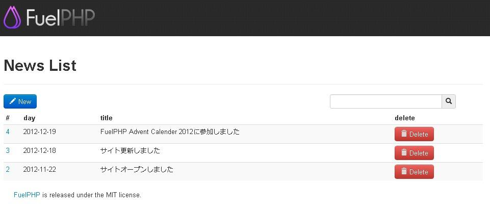
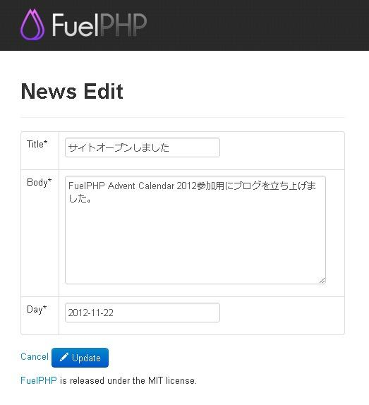

[[FuelPHP Advent Calendar 2012]FuelPHPへのDoctrine2組み込み](http://www.cry-kit.com/?p=53 "[FuelPHP Advent Calendar 2012]FuelPHPへのDoctrine2組み込み")
=======================================================================================================================================================

[FuelPHP Advent Calendar 2012](http://atnd.org/events/33753)の19日目担当の[@ttikitt](https://twitter.com/ttikitt)です。

昨日は[@tmd45](https://twitter.com/tmd45)さんの『[さくらのレンタルサーバで FuelPHP を使ってはてなハイクブログを作る－ViewModel を使ってみる編 \#FuelPHPAdvent2012](http://tech.tmd45.in/entry/2012/12/18/101053)』でした。

本日のテーマは『外部ライブラリの組み込み』です。  
 fuelphpは拡張性に富んだフレームワークで、外部ライブラリを取り込んで、容易に拡張する事ができます。  
 とはいうものの具体的に触れられている機会があまりないので、ORMライブラリの組み込みについて紹介します。

先人が居りましたため、こちらのリポジトリを元に解説・調整します。  
 [aspendigital/fuel-doctrine2](https://github.com/aspendigital/fuel-doctrine2)

組み込むライブラリについてはこちら。  
 Doctrine2 ORM([doctrine project](http://www.doctrine-project.org/))

なお、fuelphpのormパッケージも色々な機能を持っています。  
 どちらが優れているという事もないのですが、主に以下の3点の理由で採用しました。

・スキーマ定義ファイルからのModelクラス生成  
 ・Modelの役割のEntity(Rowデータ管理)とRepository(クエリ関連)への分割  
 ・簡易な読み出しをクエリ不要で取得する機能(magic finder ※fuelphpのormにも付いています。)

Symfony2に組み込まれている高機能なライブラリで、  
 他にも色々な機能があるのですが、細かい紹介は省きます。

1.fuelphpへの配置  
 まずはfuelphp内にファイルを取り込みましょう。

・Doctrine2 Object Relational Mapperのダウンロード  
 最新版の2.3.1をダウンロードします。

・fuelphpへの配置  
 fuel/app/vendor/  
 に以下のように配置します。

~~~~ {.brush: .plain; .gutter: .false; .title: .; .notranslate title=""}
vendor
├─Doctrine
│  ├─Common
│  ├─DBAL
│  └─ORM
└─Symfony
~~~~

\#SymfonyをTaskとYAMLの対応のために追加しています。

・オートローダーへの追加

~~~~ {.brush: .php; .highlight: .[0,3,4,5,6,7,8,9,10,11,12,13]; .title: .fuel/app/bootstrap.php; .notranslate title="fuel/app/bootstrap.php"}
Autoloader::register();

$dir = dirname(__FILE__) . DS;

Autoloader::add_namespace("Doctrine", $dir . 'vendor' . DS . 'Doctrine' . DS, true);
Autoloader::add_namespace("Symfony", $dir . 'vendor' . DS . 'Symfony' . DS, true);
//生成される(予定の)Modelも追加しておきます。
Autoloader::add_namespace('Entities', $dir . 'classes' . DS . 'model' . DS . 'Entities' . DS, true);
Autoloader::add_namespace('Repositories', $dir . 'classes' . DS . 'model' . DS . 'Repositories' . DS, true);
//ラッパーを追加します。
Autoloader::add_namespace('Doctrine_Fuel', $dir . 'classes' . DS);
Autoloader::alias_to_namespace('Doctrine_Fuel\Doctrine_Fuel');
~~~~

連携のためにラッパークラスを追加しています。

~~~~ {.brush: .php; .collapse: .true; .highlight: .[62]; .light: .false; .title: .fuel/app/classes/doctrine/fuel.php; .toolbar: .true; .notranslate title="fuel/app/classes/doctrine/fuel.php"}
<?php
namespace Doctrine_Fuel;

/**
 * Convenience class to wrap Doctrine configuration with FuelPHP features.
 * I'm only trying to handle relatively simple usage here, so if your configuration needs
 * are more complicated, just extend/replace in your application
 *
 * Example:
 *
 * <code>
 * $em = Doctrine_Fuel::manager();
 * $em->createQuery(...);
 * </code>
 *
 * Or to use a defined connection other than 'default'
 * <code>
 * $em = Doctrine_Fuel::manager('connection_name');
 * $em->createQuery(...);
 * </code>
 *
 */
class Doctrine_Fuel
{
    /** @var array */
    protected static $_managers;

    /** @var array */
    protected static $settings;

    /**
     * Map cache types to class names
     * Memcache/Memcached can't be set up automatically the way the other types can, so they're not included
     *
     * @var array
     */
    protected static $cache_drivers = array(
            'array'=>'ArrayCache',
            'apc'=>'ApcCache',
            'xcache'=>'XcacheCache',
            'wincache'=>'WinCache',
            'zend'=>'ZendDataCache'
        );

    /**
     * Map metadata driver types to class names
     */
    protected static $metadata_drivers = array(
            'annotation'=>'', // We'll use the factory method; just here for the exception check
            'php'=>'PHPDriver',
            'simplified_xml'=>'SimplifiedXmlDriver',
            'simplified_yaml'=>'SimplifiedYamlDriver',
            'xml'=>'XmlDriver',
            'yaml'=>'YamlDriver'
        );

    /**
     * Read configuration and set up EntityManager singleton
     */
    public static function _init()
    {
        static::$settings = \Config::load('db', true);
    }

    public static function _init_manager($connection)
    {
        $settings = static::$settings;

        if (!isset($settings[$connection]))
            throw new Exception('No connection configuration for '.$connection);

        $config = new \Doctrine\ORM\Configuration();
        $cache = static::_init_cache();
        if ($cache)
        {
            $config->setMetadataCacheImpl($cache);
            $config->setQueryCacheImpl($cache);
        }

        $config->setProxyDir($settings['proxy_dir']);
        $config->setProxyNamespace($settings['proxy_namespace']);
        $config->setAutoGenerateProxyClasses($settings['auto_generate_proxy_classes']);
        $config->setMetadataDriverImpl(static::_init_metadata($config));

        static::$_managers[$connection] = \Doctrine\ORM\EntityManager::create($settings[$connection]['connection'], $config);
        if (!empty($settings[$connection]['profiling']))
        {
            static::$_managers[$connection]->getConnection()->getConfiguration()->setSQLLogger(new Logger($connection));
        }
    }

    /**
     * @return \Doctrine\Common\Cache|false
     */
    protected static function _init_cache()
    {
        $type = \Arr::get(static::$settings, 'cache_driver', 'array');
        if ($type)
        {
            if (!array_key_exists($type, static::$cache_drivers))
                throw new \Exception('Invalid Doctrine2 cache driver: ' . $type);

            $class = '\\Doctrine\\Common\\Cache\\' . static::$cache_drivers[$type];
            return new $class();
        }

        return false;
    }

    /**
     * @return \Doctrine\ORM\Mapping\Driver\Driver
     */
    protected static function _init_metadata($config)
    {
        $type = \Arr::get(static::$settings, 'metadata_driver', 'annotation');
        if (!array_key_exists($type, static::$metadata_drivers))
            throw new \Exception('Invalid Doctrine2 metadata driver: ' . $type);

        if ($type == 'annotation')
            return $config->newDefaultAnnotationDriver(static::$settings['metadata_path']);
        $class = '\\Doctrine\\ORM\\Mapping\\Driver\\' . static::$metadata_drivers[$type];
        return new $class(static::$settings['metadata_path']);
    }

    /**
     * @return \Doctrine\ORM\EntityManager
     */
    public static function manager($connection = 'default')
    {if (!isset(static::$_managers[$connection]))
            static::_init_manager($connection);

        return static::$_managers[$connection];
    }

    /**
     * @return array Doctrine version information
     */
    public static function version_check()
    {
        return array(
            'common' => \Doctrine\Common\Version::VERSION,
            'dbal' => \Doctrine\DBAL\Version::VERSION,
            'orm' => \Doctrine\ORM\Version::VERSION,
        );
    }
}
~~~~

2.Taskの追加  
 シェルからのコマンドがありますので、oilから使用できるようにタスクも追加します。

~~~~ {.brush: .php; .title: .fuel/app/tasks/doctrine.php; .notranslate title="fuel/app/tasks/doctrine.php"}
<?php

namespace Fuel\Tasks;

class Doctrine {
    protected static function getCli(){
        $entityManager = \Doctrine_Fuel::manager();
        $cli = new \Symfony\Component\Console\Application('Doctrine Command Line Interface', \Doctrine\Common\Version::VERSION);
        $cli->setCatchExceptions(true);

        $helperSet = $cli->getHelperSet();
        $helperSet->set(new \Doctrine\DBAL\Tools\Console\Helper\ConnectionHelper($entityManager->getConnection()), 'db');
        $helperSet->set(new \Doctrine\ORM\Tools\Console\Helper\EntityManagerHelper($entityManager), 'em');

        return $cli;
    }

    public static function run($argv = 'list')
    {
        $cli = Doctrine::getCli();
        $cli->addCommands(array(
            // ORM Commands
            //new \Doctrine\ORM\Tools\Console\Command\GenerateRepositoriesCommand(),
            //new \Doctrine\ORM\Tools\Console\Command\GenerateEntitiesCommand(),
            new \Doctrine\ORM\Tools\Console\Command\SchemaTool\CreateCommand(),
            new \Doctrine\ORM\Tools\Console\Command\SchemaTool\UpdateCommand(),
            new \Doctrine\ORM\Tools\Console\Command\SchemaTool\DropCommand(),
        ));
        //oil refineの分ずれるので入力をずらします。
        array_shift($_SERVER['argv']);
        array_shift($_SERVER['argv']);
        $cli->run();
    }

    public static function version(){
        print_r(\Doctrine_Fuel::version_check());
    }

    //Model生成先を固定したいので別に定義します。
    public static function generate_entities(){
        $cli = Doctrine::getCli();
        $cli->addCommands(array(
            new \Doctrine\ORM\Tools\Console\Command\GenerateEntitiesCommand(),
        ));
        $cli->run(new \Symfony\Component\Console\Input\StringInput('orm:generate-entities ./fuel/app/classes/model'));
    }

    //Model生成先を固定したいので別に定義します。
    public static function generate_repositories(){
        $cli = Doctrine::getCli();
        $cli->addCommands(array(
            new \Doctrine\ORM\Tools\Console\Command\GenerateRepositoriesCommand(),
        ));
        $cli->run(new \Symfony\Component\Console\Input\StringInput('orm:generate-repositories ./fuel/app/classes/model'));
    }
}
~~~~

これで以下のコマンドを使用できるようになっています。

~~~~ {.brush: .jscript; .gutter: .false; .title: .; .notranslate title=""}
php oil refine doctrine:generate_entities      //Modelの生成
php oil refine doctrine:generate_repositories  //Modelの生成
php oil refine doctrine:version                //バージョンの確認
php oil refine doctrine orm:schema-tool:create //データベースの作成
php oil refine doctrine orm:schema-tool:update //データベースの更新
php oil refine doctrine orm:schema-tool:drop   //データベースの削除
~~~~

3.configの追加  
 データベース接続の設定は同じというわけにはいかないので、設定の書き方は少し変わります。

~~~~ {.brush: .php; .highlight: .[0,2,3,4,5,6,14,15,16,17,18,19]; .title: .fuel/app/config/db.php; .notranslate title="fuel/app/config/db.php"}
return array(
    'proxy_dir' => APPPATH . 'classes' . DS . 'proxy',
    'proxy_namespace' => 'Proxy',
    'metadata_path' => APPPATH . 'config' . DS . 'schema',
    'auto_generate_proxy_classes' => true,
    'metadata_driver' => 'yaml',
    'active' => 'default',

    /**
     * Base config, just need to set the DSN, username and password in env. config.
     */
    'default' => array(
        'connection'  => array(
            'driver'     => 'pdo_mysql',
            'host'        => 'localhost',
            'password'   => 'dbpass',
            'user'       => 'dbuser',
            'dbname'     => 'fuel',
            'persistent' => false,
        ),
        'identifier'   => '`',
        'table_prefix' => '',
        'charset'      => 'utf8',
        'enable_cache' => true,
        'profiling'    => false,
    ),
);
~~~~

EntityクラスがArrayAccessを備えているため、fuelphpの対策に引っかかってしまう時があります。  
 場合によってはホワイトリストに追加することになります。

~~~~ {.brush: .php; .highlight: .[2]; .title: .fuel/app/config/config.php; .notranslate title="fuel/app/config/config.php"}
        'whitelisted_classes' => array(
            'Entities\News',
        )
~~~~

4.Modelの生成  
 スキーマファイルの書式はいくつか利用できますが、今回はYAMLを使用します。

~~~~ {.brush: .plain; .title: .fuel/app/config/schema/Entities.News.dcm.yml; .notranslate title="fuel/app/config/schema/Entities.News.dcm.yml"}
Entities\News:
  type: entity
  repositoryClass: Repositories\News
  table: News
  id:
    newsId:
      type: integer
      generator:
        strategy: AUTO
  fields:
    title:
      type: string
      length: 50
    body:
      type: string
      length: 1000
    day:
      type: datetime
    created:
      type: datetime
    updated:
      type: datetime
    sortNo:
      type: integer
  lifecycleCallbacks:
    prePersist: [ prePersist ]
    preUpdate: [ preUpdate ]
~~~~

スキーマからModelとデータベースを生成します。  
 \#php oil refine doctrine:generate\_entities  
 \#php oil refine doctrine:generate\_repositories  
 \#php oil refine doctrine orm:schema-tool:create –force

実行するとfuel/app/classes/modelのEntitiesとRepositoriesにクラスが生成されています。  
 ついでにちょっとした改造も加えますが、この変更は再生成しても自動的にマージされます。  

~~~~ {.brush: .php; .collapse: .true; .highlight: .[133,135,156,158,200,201,209]; .light: .false; .title: .fuel/app/classes/model/Entities/News.php; .toolbar: .true; .notranslate title="fuel/app/classes/model/Entities/News.php"}
<?php

namespace Entities;

use Doctrine\ORM\Mapping as ORM;

/**
 * News
 */
class News {

    /**
     * @var integer
     */
    private $newsId;

    /**
     * @var string
     */
    private $title;

    /**
     * @var string
     */
    private $body;

    /**
     * @var \DateTime
     */
    private $day;

    /**
     * @var \DateTime
     */
    private $created;

    /**
     * @var \DateTime
     */
    private $updated;

    /**
     * @var integer
     */
    private $sortNo;

    /**
     * Get newsId
     *
     * @return integer
      */
    public function getNewsId()
    {
        return $this->newsId;
    }

    /**
     * Set title
     *
     * @param string $title
     * @return News
     */
    public function setTitle($title)
    {
        $this->title = $title;

        return $this;
    }

    /**
     * Get title
     *
     * @return string
     */
    public function getTitle()
    {
        return $this->title;
    }

    /**
     * Set body
     *
     * @param string $body
     * @return News
     */
    public function setBody($body)
    {
        $this->body = $body;

        return $this;
    }

    /**
     * Get body
     *
     * @return string
     */
    public function getBody()
    {
        return $this->body;
    }

    /**
     * Set day
     *
     * @param \DateTime $day
     * @return News
     */
    public function setDay($day)
    {
        $this->day = $day;

        return $this;
    }

    /**
     * Get day
     *
     * @return \DateTime
     */
    public function getDay()
    {
        return $this->day;
    }

    /**
     * Set created
     *
     * @param \DateTime $created
     * @return News
     */
    public function setCreated()
    {
        $this->created = new \DateTime();

        return $this;
    }

    /**
     * Get created
     *
     * @return \DateTime
     */
    public function getCreated()
    {
        return $this->created;
    }

    /**
     * Set updated
     *
     * @param \DateTime $updated
     * @return News
     */
    public function setUpdated()
    {
        $this->updated = new \DateTime();

        return $this;
    }

    /**
     * Get updated
     *
     * @return \DateTime
     */
    public function getUpdated()
    {
        return $this->updated;
    }

    /**
     * Set sortNo
     *
     * @param integer $sortNo
     * @return News
     */
    public function setSortNo($sortNo)
    {
        $this->sortNo = $sortNo;

        return $this;
    }

    /**
     * Get sortNo
     *
     * @return integer
     */
    public function getSortNo()
    {
        return $this->sortNo;
    }
    /**
     * @ORM\PrePersist
     */
    public function prePersist()
    {
        setUpdated();
        setCreated();
    }

    /**
     * @ORM\PreUpdate
     */
    public function preUpdate()
    {
        setUpdated();
    }

 　　　/**
     * FieldSetとの連携用
     */
    public static function set_form_fields($fieldset, $instance = null){
        $fieldset->add('Title', 'Title', array('type' => 'text'), array(array('required')));
        $fieldset->add('Body', 'Body', array(
　　　　　　　　　　　'type' => 'textarea',
　　　　　　　　　　　'rows' => 8,), array(array('required')));
        $fieldset->add('Day', 'Day', array('type' => 'text'), array(array('required')));
        if($instance){
            $fieldset->populate(array(
                'Title' => $instance->getTitle(),
                'Body' => $instance->getBody(),
                'Day' => $instance->getDay()?$instance->getDay()->format('Y-m-d'):date('Y-m-d'),
            ));
        }
    }
}
~~~~

ゲッター・セッター、前処理を備えたクラスができています。

~~~~ {.brush: .php; .highlight: .[0,15,16,17,18,19,20,21,22]; .title: .fuel/app/classes/model/Repositories/News.php; .notranslate title="fuel/app/classes/model/Repositories/News.php"}
<?php

namespace Repositories;

use Doctrine\ORM\EntityRepository;

/**
 * News
 *
 * This class was generated by the Doctrine ORM. Add your own custom
 * repository methods below.
 */
class News extends EntityRepository {

    public function getNewsList($filter = ''){
        $q = $this->createQueryBuilder('n')
　　　　　　　　　->orderBy('n.Day', 'DESC');
        if($filter){
            $q->where('n.title LIKE ?1')
              ->setParameter(1, '%'.$filter.'%');
        }
        return $q->getQuery()->getResult();
    }
}
~~~~

こちらは空ですが、magic finderは使えます。

5.使ってみる！  
 駆け足でやってまいりましたが、一番大事な使い勝手を軽く試してみましょう。

~~~~ {.brush: .php; .highlight: .[3,5,6]; .title: .fuel/app/config/routes.php; .notranslate title="fuel/app/config/routes.php"}
<?php
return array(
    '_root_'  => 'news/list',  // The default route
    
    'news/edit(/:newsid)?' => array('news/edit'),
    'news/delete(/:newsid)?' => array('news/delete'),
);
~~~~

~~~~ {.brush: .php; .title: .fuel/app/classes/controller/news.php; .notranslate title="fuel/app/classes/controller/news.php"}
<?php

/**
 * The News Controller.
 *
 * A fuelPHP with Doctrine 2 ORM example.
 * 
 * @package  app
 * @extends  Controller
 */
class Controller_News extends Controller
{

    /**
     * The news list action.
     * 
     * @access  public
     * @return  Response
     */
    public function action_list()
    {
        $em = Doctrine_Fuel::manager();
        $search = Input::post('search');
        $newsList = $em->getRepository('Entities\News')->getNewsList($search);

        return Response::forge(View::forge('news/list', array('newsList' => $newsList, 'search' => $search)));
    }

    /**
     * News edit or insert action.
     * 
     * @access  public
     * @return  Response
     */
    public function action_edit($newsid = null)
    {
        $em = Doctrine_Fuel::manager();
        if($newsid)
        {
            $news = $em->find('Entities\News', $newsid);
        }
        else
        {
            $news = new \Entities\News();
        }
        $form = Fieldset::forge('news')->add_model('Entities\News', $news);

        if('POST' == Input::method())
        {
            $val = $form->validation();
            if($val->run())
            {
                $em->persist($news);
                $news->setTitle(Input::post('Title'));
                $news->setBody(Input::post('Body'));
                $news->setDay(Input::post('Day'));
                $em->flush();
                Response::redirect('news/list');
            }
            $form->repopulate();
        }
        return Response::forge(View::forge('news/edit', array('form' => $form->build()), false));
    }

    /**
     * News delete action.
     * 
     * @access  public
     * @return  Response
     */
    public function action_delete($newsid)
    {
        $em = Doctrine_Fuel::manager();
        if($newsid)
        {
            $news = $em->find('Entities\News', $newsid);
            if($news)
            {
                $em->remove($news);
                $em->flush();
            }
        }
        Response::redirect('news/list');
    }
}
~~~~

news/list  

 news/edit  

 特に違和感無く内臓ORMのように使えています。

6.最後に  
 題材がORMということもあり少々長い上に難しい内容になってしまいましたが、いかがでしたでしょうか。  
 少し手を加えるだけで今まで使っていたライブラリの機能も利用する事もできます。

明日は@\_halt\_compilerさんの『某サービスでFuelPHPを使った際のアレコレ(仮)』です。

